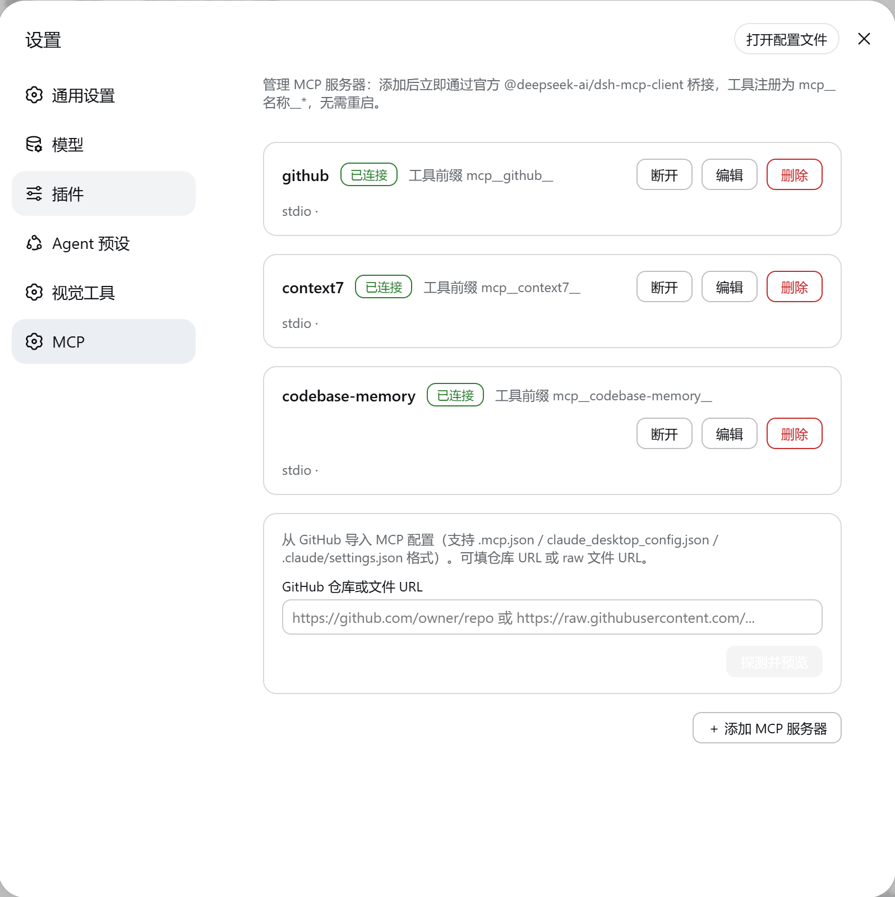

# dsh-mcp-console

DSH（DeepSeek Harness）MCP 管理面板插件：在 WebUI **设置 → MCP** 提供图形化管理界面——查看 / 添加 / 编辑 / 删除 MCP 服务器（stdio 本地进程与 streamable-http 远程端点），支持从 **GitHub 导入** MCP 配置，添加/删除/编辑**即时生效，无需重启**。

底层复用官方桥接 `@deepseek-ai/dsh-mcp-client`：每个服务器通过 `ctx.plugin()` 动态加载官方插件实例，工具注册为 `mcp__<serverName>__<rawName>`。



## 功能

- **设置 → MCP 面板**：服务器列表（状态徽章：已连接 / 连接中 / 错误 / 未连接 / 已禁用；工具前缀提示），3 秒自动刷新
- **服务器操作**：连接 / 断开 / 编辑 / 删除（热更新，无需重启）
- **添加 / 编辑服务器**：
  - `stdio`：command / args / env（JSON）/ cwd —— Windows 下自动把 `npx` 转换为 `node.exe + npx-cli.js`（`spawn` 无法直接执行 `.cmd`）
  - `streamable-http`：url / headers（JSON，如认证 token）
- **GitHub 导入**：粘贴仓库 URL（自动探测 `.mcp.json` / `.claude/settings.json` / `claude_desktop_config.json` / `.github/mcp.json` / `mcp.json`）或 raw 文件 URL → 预览候选服务器（勾选）→ 批量导入
- **敏感信息零落盘**：env 值支持 `${VAR}` 模板，运行时解析为进程环境变量（如 `GITHUB_TOKEN: "${GITHUB_TOKEN}"`），token 不写入配置文件
- **持久化**：服务器配置存于 `~/.dsh/mcp-console.json`，重启自动重连
- **安装即用**：自带 `dsh.bundle.patch`，`dsh plugin add` 后自动激活，无需手工改配置

## 安装

```sh
# 1. 停止 dsh web（插件安装期间禁止修改 profile）
# 2. 安装（github 源或 npm 源二选一）
dsh plugin --profile web add github:HHHEEEWWW/dsh-mcp-console#main
# 3. 重启 dsh web
# 4. 打开 Web UI：设置（左下角齿轮）→ MCP
```

## 使用

1. 打开 **设置 → MCP**（左下角齿轮图标 → 左侧导航 "MCP"）
2. **＋ 添加 MCP 服务器**：
   - **stdio**：名称（工具前缀 `mcp__名称__*`）、命令（如 `npx`）、参数（如 `-y @modelcontextprotocol/server-filesystem /path`）、可选 env（JSON）与 cwd
   - **HTTP**：名称、URL、可选 headers（JSON）
3. **GitHub 导入**：粘贴仓库 URL → 预览候选 → 勾选 → 批量导入
4. 状态徽章显示实时连接状态；连接后工具立即可用（如 `mcp__github__create_issue`）

### env 模板（推荐做法）

```json
{
  "env": {
    "GITHUB_TOKEN": "${GITHUB_TOKEN}"
  }
}
```

`${VAR}` 在运行时替换为 dsh web 进程的环境变量；未定义的环境变量保持字面值。配合启动脚本设置环境变量（如 `for /f "delims=" %%i in ('gh auth token') do set GITHUB_TOKEN=%%i`），token 全程不落盘。

## 架构

| 部分 | 文件 | 说明 |
|---|---|---|
| 后端 host | `lib/index.js` | `inject=['tools']` + 动态 `ctx.inject(['webServer'])`；服务器 CRUD（`~/.dsh/mcp-console.json` 持久化）；`ctx.plugin(mcpClient, config)` 动态加载官方桥接（fiber dispose/重建实现热增删）；GitHub 探测与解析；`${VAR}` env 模板；REST API `/mcp-console/api/*` |
| 前端 client | `lib/client.js` | 手写 `window.__ModuleLoader__.load()` CJS bundle（零构建工具链）；`ctx.slots.inject('settings.section')` 注册 "MCP" 面板 |
| 激活 | `cordis.patch.yml` | bundle patch：`insert {id: mcp-console, name: dsh-mcp-console}`，`dsh plugin add` 自动应用 |

## API

```
GET  /mcp-console/api/servers                  列表 + 实时状态
POST /mcp-console/api/servers                  添加（{name, transport, config}）
PUT  /mcp-console/api/servers/:id              编辑（热更新）
DEL  /mcp-console/api/servers/:id              删除
POST /mcp-console/api/servers/:id/connect      连接 / 重连
POST /mcp-console/api/servers/:id/disconnect   断开（保留配置）
POST /mcp-console/api/import/github            探测 GitHub 配置 {url} → {source, candidates}
POST /mcp-console/api/import/apply             批量导入 {candidates}
GET  /mcp-console/api/diag                     SDK 诊断（进程内 new Client 状态）
```

## 依赖

- 运行时零 npm 依赖：`@deepseek-ai/dsh-mcp-client` 与 `@modelcontextprotocol/sdk` 由 DSH 宿主提供（`$DSH_HOME/profiles/node_modules` 平面链接层）
- 环境：Windows / Linux / macOS，Node 22.19+ 或 24+，DSH web profile

## 开发

```sh
npm run check   # node --check 语法校验
```

本地调试：停止 dsh web 后把本目录复制到 `~/.dsh/profiles/web/node_modules/dsh-mcp-console/`，并在 `cordis.patch.yml` 追加：

```yaml
- insert:
    - id: mcp-console
      name: 'dsh-mcp-console'
```

重启 dsh web 生效。

## 已知限制

- 只桥接 MCP 工具能力（resources / prompts 暂不支持，与官方桥接一致）
- HTTP 服务器仅支持静态 headers 认证（与官方桥接能力对齐）
- 服务器配置（不含 env 展开值）明文存于 `~/.dsh/mcp-console.json`，含敏感 headers 时请使用 `${VAR}` 模板
- stdio 参数按空格分词（引号可保护含空格的参数），无 shell 展开

## License

MIT
